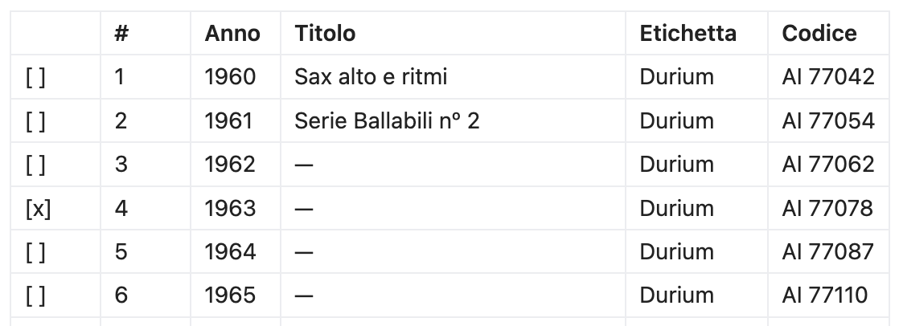
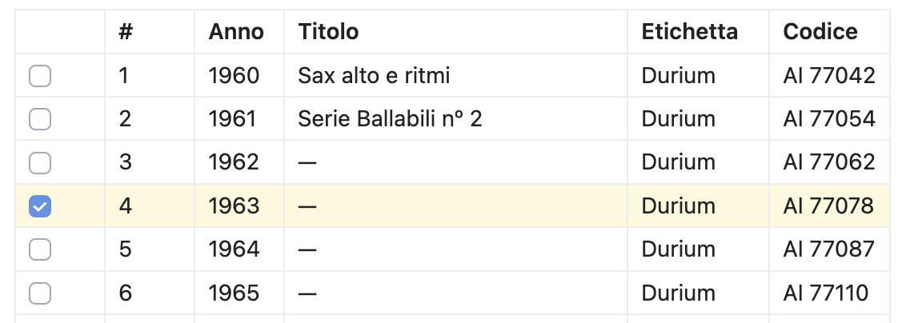
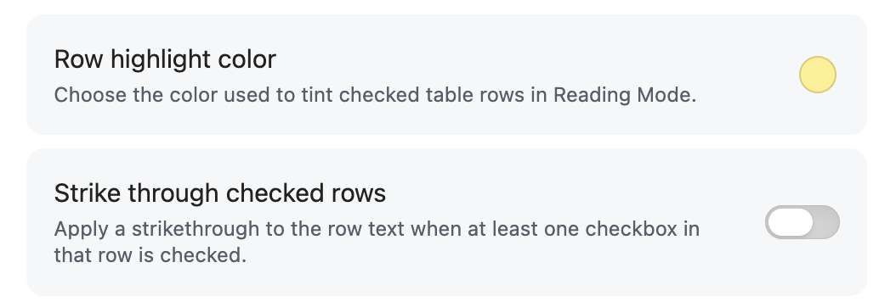

# Table Checkbox Row Color

This is a fork of the [Obsidian](https://obsidian.md/) plugin "[Table Checkbox Renderer](https://github.com/dannns/obsidian-table-checkbox-renderer)" by Daniel Aguerrevere. It adds row color highlighting and optional strikethrough support for checked table rows in Reading Mode.

## Overview

Beyond simple checkbox functionality, this plugin highlights entire table rows when one or more checkboxes in that row are checked, with customizable highlight colors via Obsidian settings. You can optionally enable strikethrough for checked rows. The plugin supports multiple checkboxes per cell and works with any table structure, including complex layouts, making it a robust solution for task tracking, study notes, or project management within tables.

## Demo

Writing mode

Reading mode

Settings

## Features

- Interactive checkboxes in Markdown tables in Reading Mode.
- Highlights the entire row when at least one checkbox in that row is checked.
- Obsidian settings let you change the row highlight color.
- A toggle can enable or disable strikethrough for checked rows.
- Supports multiple checkboxes per cell and per row.
- Changes are immediately saved to the Markdown file.
- Robust mapping between rendered checkboxes and source Markdown.
- Works with any table structure, including complex layouts.

## Usage

- Install the plugin in Obsidian.
- Create a Markdown table with checkboxes such as `[ ]` and `[x]`.
- Click checkboxes in Reading Mode to toggle and save changes.
- Checked rows are highlighted automatically so completed items stand out visually.
- The default highlight color is a light pastel yellow.
- In the plugin settings, you can pick the highlight color and decide whether checked rows should be struck through.
- In Edit Mode, checkboxes remain text and can be toggled directly in the editor.

### Development

- Edit the TypeScript source files in the project directory.
- Install npm `npm install`.
- Run `npm run build` after making changes to produce the updated plugin files.
- Load the plugin in Obsidian's community plugins folder for testing.

## Contributing

Pull requests and suggestions are welcome!

## License
2026 - Matteo Paolieri 

MIT
